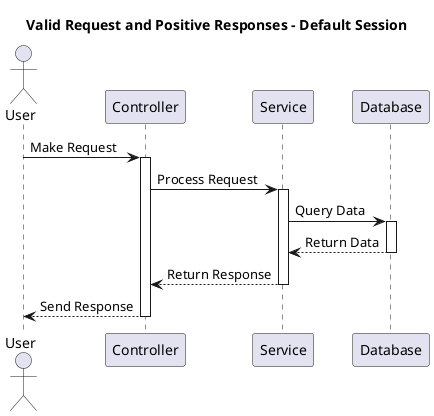
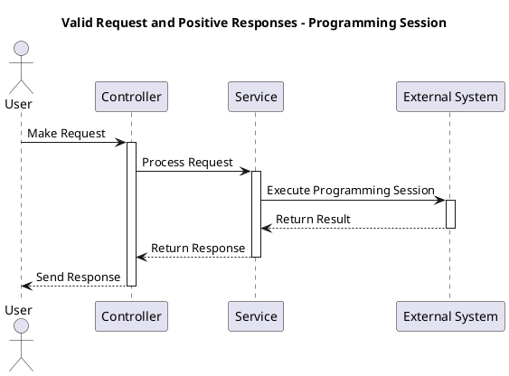
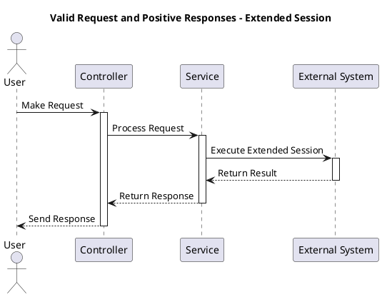
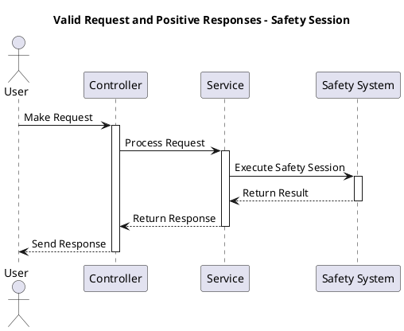
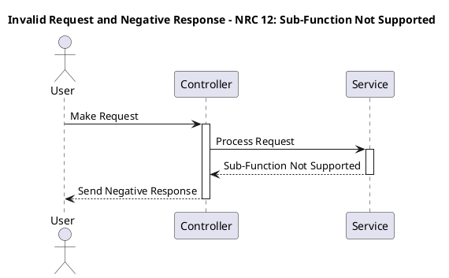
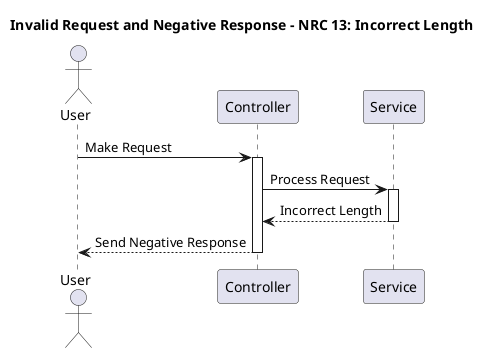
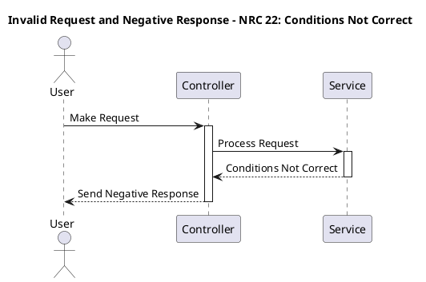

# Diagnostic Session Control (0x11)

## 1. Purpose

The purpose of the Diagnostics Session Control service (0x11) within Unified Diagnostic Services (UDS) is to facilitate the switching between different diagnostic sessions. Diagnostic sessions represent distinct operating states or modes within the diagnostic system. This service allows for the transition from one session to another based on various criteria such as standards, recommendations, OEM specifications, or specific requirements of the vehicle manufacturer or system supplier.

## 2. Short Description

The Diagnostics Session Control service enables the management of diagnostic sessions, ensuring that only one session is active at any given time. It ensures adherence to timing parameters and allows for seamless transition between sessions as per the diagnostic requirements.

## 3. Sub-functions Supported

The primary sub-function supported by Diagnostics Session Control service includes switching between different diagnostic sessions.

## 4. Detailed Description

The Diagnostics Session Control service is a vital component of UDS, operating at the data link layer (Layer 2) of the OSI model. It governs the timing parameters associated with diagnostic sessions, ensuring proper communication between the tester (diagnostic tool) and the server (ECU or Electronic Control Unit).

- **Single Active Session**: Only one diagnostic session can be active at any given time. Upon power-up, if no other session is explicitly enabled, the server defaults to a predetermined session.
- **Diagnostic Functionality**: The ECU is required to maintain diagnostic functionality under normal operating conditions as well as under other defined operating conditions, which may vary based on the specifications provided by the vehicle manufacturer, system supplier, or other relevant entities.
- **Handling of Session Requests**: When a tester requests a specific diagnostic session (e.g., 01, 02, 03, or 04), the server checks if the requested session is already active. If the requested session is currently running, the server sends a positive response message and continues to operate according to the characteristics of the active session.
- **Transitioning between Sessions**: Upon receiving a request for a new diagnostic session, the server ensures a seamless transition by sending a positive response message before the timings of the new session become active within the server. This preemptive response ensures that the tester can begin communication with the new session without delays.

## 5. Request Message Frame

The request message frame for the Diagnostics Session Control service typically includes the service identifier (0x11) along with any additional parameters specifying the desired diagnostic session.

## 6. Positive Response Message Frame

The positive response message frame acknowledges successful execution of the requested service, confirming the transition to the specified diagnostic session.

## 7. Supported NRC’s (Negative Response Codes)

While the Diagnostics Session Control service aims for seamless session transitions, certain conditions may prevent its execution. In such cases, the server may issue Negative Response Codes (NRCs) to indicate the reason for the failure.

## 8. Negative Response Frame

The negative response frame is sent by the server to indicate a failure or rejection of the requested service. It includes an NRC indicating the specific issue encountered during the attempt to switch sessions.

### Sub-function Description

- **00 Reserved**: This sub-function code is reserved and not assigned to any specific diagnostic session.
- **01 Default Session**: The default session represents the standard operational mode of the diagnostic system. It typically encompasses basic diagnostic functionalities required for routine maintenance and troubleshooting.
- **02 Programming Session**: The programming session is dedicated to activities related to ECU programming or reprogramming. It provides access to functions necessary for updating firmware, calibration data, or configuration parameters within the electronic control units.
- **03 Extended Diagnostic Session**: The extended diagnostic session offers an expanded set of diagnostic capabilities beyond those available in the default session. It may include advanced diagnostic tests, parameter monitoring, or configuration options not accessible in other sessions.
- **04 Safety System Diagnostic Session**: This session is specifically designed for diagnosing safety-critical systems within the vehicle, such as airbag systems, anti-lock braking systems (ABS), or electronic stability control (ESC) systems. It prioritizes the identification and resolution of issues affecting the safety of vehicle occupants.
- **05-3F Reserved**: These sub-function codes are reserved for future allocation and currently not assigned to any specific diagnostic sessions.
- **40-5F Vehicle Manufacturer Specific**: Sub-function codes in this range are reserved for diagnostic sessions defined by individual vehicle manufacturers. Each manufacturer may utilize these codes to implement custom diagnostic sessions tailored to their specific vehicle models or system requirements.
- **60-7E System Supplier Specific**: Similar to the manufacturer-specific codes, sub-function codes in this range are reserved for diagnostic sessions defined by system suppliers or component manufacturers. These sessions may cater to specialized diagnostic needs associated with particular vehicle subsystems or components.
- **7F Reserved**: This sub-function code is reserved and not assigned to any specific diagnostic session.

These sub-function descriptions provide a comprehensive overview of the different diagnostic sessions supported by the Diagnostics Session Control service. Each session serves distinct purposes and may offer unique diagnostic functionalities tailored to specific vehicle systems, manufacturer preferences, or component requirements. By supporting a diverse range of sessions, UDS enables comprehensive diagnostic capabilities across various vehicles and system configurations.

## Transitions

Unified Diagnostic Services (UDS) is a diagnostic communication protocol used in automotive electronics to provide secure, standardized, and reliable communication between a vehicle's electronic control units (ECUs) and a diagnostic tester. UDS defines a set of services, parameters, and communication protocols for diagnostic purposes. Diagnostic sessions are fundamental to the UDS protocol. They represent different states of communication between the diagnostic tester (client) and the vehicle's ECUs (server). Session control governs the transition between these states, ensuring efficient and effective diagnostic communication.

**1. Session States:**

UDS defines several session states, each with its specific characteristics and functionalities. The primary session states are:

- Default Session: The initial session state established when the communication between the diagnostic tester and the vehicle begins. In this state, the diagnostic services are available for basic diagnostic functions.
- Non-Default Session: Any session state other than the default session. Non-default sessions provide access to advanced diagnostic functions and may have additional security or functionality requirements.

**2. Session Transition Rules:**

UDS specifies rules for transitioning between session states to ensure consistent behavior and maintain the integrity of diagnostic communication. These transition rules are crucial for managing the state of the diagnostic session effectively. Key transition rules include:

**Transition from Default Session to Default Session:**

- When the server is in the default session and the client requests to start another default session, the server shall completely re-initialize the default session. However, this re-initialization process shall not impact Non-Volatile Memory (NVM) settings.

**Transition from Default Session to Non-Default Session:**

- When the server transitions from the default session to any non-default session, it shall reset only the events that have been configured in the server. Other parameters and settings, including NVM settings, shall remain unaffected.

**Transition between Non-Default Sessions:**

- When transitioning from one non-default session to another, or the same non-default session, any configured periodic scheduler shall remain active. Additionally, the states of the Communication Control and Control DTC Setting services shall not be affected. For instance, if normal communication is disabled at the time of session switch, it shall remain disabled in the new session state.

**3. Impact on Services and Parameters:**

It's essential to understand the impact of session transitions on various services and parameters within the UDS protocol. While session transitions may reset certain events or settings, they should not affect the overall functionality of diagnostic services. Key considerations include:

- NVM Settings: Session transitions should not impact Non-Volatile Memory settings, ensuring that critical configuration data remains intact across sessions.
- Communication Control: The state of communication control services, such as normal communication or specific communication modes, should remain consistent across session transitions to maintain communication integrity.
- Control DTC Setting: Similarly, the settings related to Diagnostic Trouble Code (DTC) handling and reporting should persist across session transitions to ensure accurate diagnostic information.

## Valid Request and Positive Responses

### Default Session

### Programming Session

### Extended Session

### Safety Session

## Invalid Request and Negative Response

### NRC 12 - Sub-Function Not Supported

### NRC 13 - Incorrect Length

### NRC 22: Conditions Not Correct

