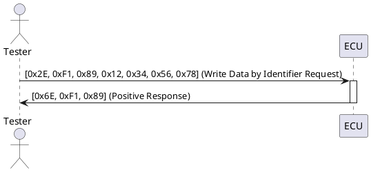

## Comprehensive Tutorial on UDS Write Data by Identifier Service

### Introduction

The "Write Data by Identifier" service (Service ID 0x2E) in the Unified Diagnostic Services (UDS) protocol is utilized to write specific data into an Electronic Control Unit (ECU). This service is often used to configure various parameters within the ECU, such as part numbers, hardware numbers, and software numbers. It can also be used to erase Non-Volatile Memory (NVM) data, reset calibration values, and set option content. The data to be written is identified by a Data Identifier (DID).

### Structure of the Write Data by Identifier Service

The UDS protocol specifies the structure for requests and responses for the "Write Data by Identifier" service. Below is a detailed breakdown of the request and response frames:

#### Request Frame

1. **Service ID (1 byte)**: Identifies the service (0x2E for Write Data by Identifier).
2. **Data Identifier (2 bytes)**: Specifies the location within the ECU where the data should be written.
3. **Data (N bytes)**: The actual data to be written. The length and format of this data depend on the specific Data Identifier.

#### Positive Response Frame

1. **Service ID (1 byte)**: Echoes the service ID (0x6E for positive response to Write Data by Identifier).
2. **Data Identifier (2 bytes)**: Echoes the Data Identifier from the request.

#### Negative Response Frame

1. **Negative Response Indicator (1 byte)**: Always 0x7F.
2. **Service ID (1 byte)**: Echoes the service ID (0x2E in this case).
3. **Negative Response Code (NRC) (1 byte)**: Indicates the reason for the negative response. Possible NRCs include:
   - 0x12: Sub-function not supported.
   - 0x13: Incorrect message length.
   - 0x22: Conditions not correct.
   - 0x31: Request out of range.

### Conditions and Constraints

- **Security Access**: Some data identifiers may require prior security access (Service 0x27) to ensure secure communication.
- **Manufacturer Constraints**: Vehicle manufacturers might impose conditions that must be met before this service can be executed. If these conditions are not met, NRC 0x22 (Conditions not correct) is returned.
- **Read-Only Identifiers**: Not all data identifiers are writable. Some are read-only and will not accept write requests.

### Example Scenarios

#### Scenario 1: Successful Write Operation

A tester wants to update the part number stored in the ECU. The request and response sequence would look like this:

**Request**:

```
[0x2E, 0xF1, 0x89, 0x12, 0x34, 0x56, 0x78]
```

- 0x2E: Service ID for Write Data by Identifier.
- 0xF1, 0x89: Data Identifier for part number.
- 0x12, 0x34, 0x56, 0x78: New part number to be written.

**Positive Response**:

```
[0x6E, 0xF1, 0x89]
```

- 0x6E: Positive response for Write Data by Identifier.
- 0xF1, 0x89: Echoes the Data Identifier.

#### Scenario 2: Negative Response due to Conditions Not Correct

A tester attempts to write data to an ECU without meeting the required preconditions.

**Request**:

```
[0x2E, 0xF1, 0x89, 0x12, 0x34, 0x56, 0x78]
```

**Negative Response**:

```
[0x7F, 0x2E, 0x22]
```

- 0x7F: Negative Response Indicator.
- 0x2E: Service ID for Write Data by Identifier.
- 0x22: Conditions not correct.

### PlantUML Sequence Diagram

Below is a PlantUML sequence diagram illustrating a successful write operation.



### Handling Errors

The ECU can respond with various Negative Response Codes (NRCs) to indicate different types of errors. Below is an explanation of the common NRCs for the Write Data by Identifier service:

- **0x12 (Sub-function Not Supported)**: The requested sub-function is not supported by the ECU.
- **0x13 (Incorrect Message Length)**: The request message length is incorrect.
- **0x22 (Conditions Not Correct)**: The required preconditions for the service are not met.
- **0x31 (Request Out of Range)**: The requested data identifier is out of the acceptable range for the service.

### Conclusion

The Write Data by Identifier service in UDS is a powerful tool for configuring and updating ECU parameters. Understanding the structure of request and response frames, as well as the conditions and constraints, is essential for successfully using this service. By following the guidelines and handling possible error responses appropriately, one can effectively manage ECU configurations in a vehicle's diagnostic system.
