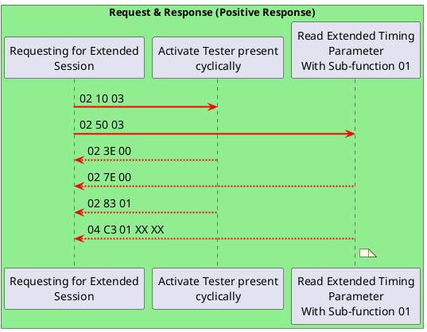

```plantuml

@startuml
skinparam arrowColor red
skinparam arrowThickness 2
skinparam sequenceArrowFontSize 14

box "Request & Response (Positive Response)" #LightGreen
participant "Requesting for Extended\nSession" as A
participant "Activate Tester present\ncyclically" as B
participant "Read Extended Timing\nParameter\nWith Sub-function 01" as C

A->B: 02 10 03
A->C: 02 50 03
B-->A: 02 3E 00
C-->A: 02 7E 00
B-->A: 02 83 01
C-->A: 04 C3 01 XX XX

note right of C
 
endnote

@enduml

```