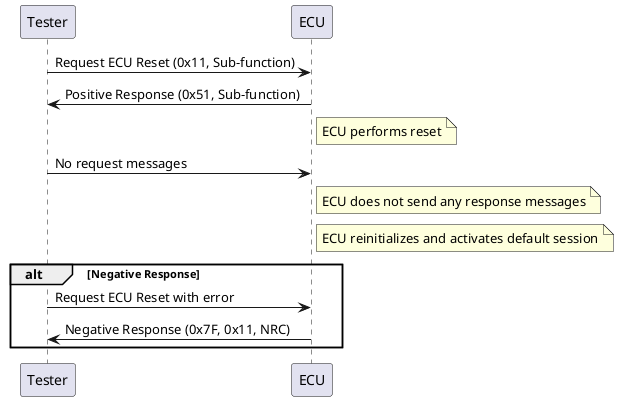

## Comprehensive Tutorial on ECU Reset (0x11) Service

### Introduction

The Electronic Control Unit (ECU) Reset service (0x11) is a critical diagnostic service used to restart the ECU. This service ensures that the ECU can be reset in a controlled manner, allowing for proper initialization of the system. The ECU sends a positive response to the tester before the reset is executed. After a successful reset, the ECU activates the default session. During the reset process, the ECU does not accept any other request messages or send any response messages.

### Sub-functions of ECU Reset

The ECU Reset service supports various sub-functions, each identified by an enum value:

| Enum Value | Description                   |
| ---------- | ----------------------------- |
| 0x00       | SAE Reserved                  |
| 0x01       | Hard Reset                    |
| 0x02       | Key Off On Reset              |
| 0x03       | Soft Reset                    |
| 0x04       | Enable Rapid Power Shut Down  |
| 0x05       | Disable Rapid Power Shut Down |
| 0x06-0x3F  | ISO SAE Reserved              |
| 0x40-0x5F  | OEM Specific                  |
| 0x60-0x7E  | Supplier Specific             |
| 0x7F       | SAE Reserved                  |

### Request and Response Frames

- **Request Frame:**

  1. Service Id (0x11)
  2. Sub-function (Reset)
- **Positive Response Frame:**

  1. Service Id (0x51)
  2. Sub-function (Reset)
- **Negative Response Frame:**

  1. Negative Response (0x7F)
  2. Service Id (0x11)
  3. NRC Code

### Sub-function Details

#### 1. Hard Reset (0x01)

- Simulates a power-on or start-up condition.
- Resets both volatile and non-volatile memory.
- Used when the ECU needs to reinitialize all components.

#### 2. Key Off On Reset (0x02)

- Simulates the driver turning the ignition key off and back on.
- Typically preserves non-volatile memory and initializes volatile memory.
- The specific implementation may vary.

#### 3. Soft Reset (0x03)

- Restarts the application without reinitializing previously learned data.
- Typically used to restart the software while maintaining adaptive data.

#### 4. Enable Rapid Power Shut Down (0x04)

- Enables the server to perform a rapid power shut down after the ignition is switched off.
- Transitions the server to sleep mode after a defined stand-by time.

#### 5. Disable Rapid Power Shut Down (0x05)

- Disables the previously enabled rapid power shut down function.

### Example Scenario

A tester needs to reset the ECU to clear Diagnostic Trouble Codes (DTCs) after fixing issues such as brake failure or camera lens adjustment. The ECU Reset service is used to ensure that both volatile and non-volatile memory is cleared and the ECU reinitializes correctly.

### List of Negative Response Codes (NRCs)

| NRC Code | Description                |
| -------- | -------------------------- |
| 0x12     | Sub-function Not Supported |
| 0x13     | Incorrect Message Length   |
| 0x22     | Conditions Not Correct     |
| 0x33     | Security Access Denied     |

- **Sub-function Not Supported (0x12):** Sent if the tester requests an unsupported sub-function.
- **Incorrect Message Length (0x13):** Sent if the request message length is incorrect.
- **Conditions Not Correct (0x22):** Sent if the server conditions are not met (e.g., engine should be OFF for an engine management ECU reset).
- **Security Access Denied (0x33):** Sent if the service is requested without unlocking security access.

### Sequence Diagram

This sequence diagram illustrates the interaction between the tester and the ECU during the reset process. It shows how the ECU responds positively before executing the reset and handles negative responses in case of errors.

### Conclusion

The ECU Reset service (0x11) is essential for ensuring proper initialization and reinitialization of the ECU. Understanding the different sub-functions and handling various scenarios, including negative responses, is crucial for effective ECU management. This comprehensive tutorial should provide a clear understanding of how to utilize the ECU Reset service in various diagnostic and operational contexts.
