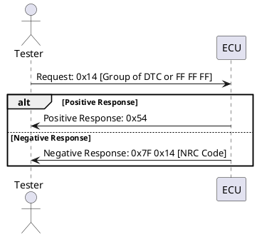

## Clear Diagnostic Information (0x14)

### Introduction

The Unified Diagnostic Services (UDS) protocol is a part of the ISO 14229 standard, used in the automotive industry for diagnostics and communication with Electronic Control Units (ECUs). One of the services provided by UDS is the Clear Diagnostic Information service, identified by the service ID 0x14. This service allows a diagnostic tester to clear Diagnostic Trouble Codes (DTCs) from an ECU's memory.

### Purpose

The Clear Diagnostic Information service enables the clearing of diagnostic information from one or more ECUs. This is crucial for ensuring that the diagnostic memory is reset after issues are diagnosed and resolved, allowing the system to correctly monitor and report new issues.

### Functional Overview

The ECU responds with a positive response when the Clear Diagnostic Information service has been processed, regardless of whether any DTCs were stored. This service can clear various types of diagnostic data, including:

- DTC status bytes
- DTC snapshot data
- DTC extended data
- Other related DTC information such as first/most recent DTC, flags, counters, timers, etc.
- DTC information in optional DTC mirror memory

### Request and Response Frames

#### Request Frame

The structure of the request frame for the Clear Diagnostic Information service includes:

1. **Service ID**: 0x14
2. **Group of DTC**: Optional 3-byte value indicating the group of DTCs or a particular DTC to be cleared. To clear all DTCs, the value FF FF FF is used.

Example:

- To clear all DTCs: `0x14 FF FF FF`
- To clear a specific DTC group: `0x14 [Group of DTC]`

#### Response Frame

The ECU responds with either a positive or negative response:

1. **Positive Response Frame**:

   - **Service ID**: 0x54 (0x40 + 0x14)
   - No additional data parameters are included.

   Example:

   - Positive response: `0x54`
2. **Negative Response Frame**:

   - **Negative Response Code (NRC)**: 0x7F
   - **Service ID**: 0x14
   - **NRC Code**: Specifies the reason for failure.

   Example:

   - Negative response: `0x7F 0x14 [NRC Code]`

### Negative Response Codes (NRCs)

The Negative Response Codes (NRCs) provide detailed information on why a request may have failed:

1. **0x13 - Incorrect Message Length**: Indicates that the message length is incorrect.
2. **0x22 - Conditions Not Correct**: Indicates that the conditions required for clearing DTCs are not met. This can occur under various circumstances:

   - Requested server operating conditions are not met.
   - Internal server conditions are not met.
   - The server is in a critical mode.
   - A server request is already in progress and has yet to finish.
   - The requested criteria are not met in the server.
3. **0x31 - Request Out of Range**: Indicates that the requested DTC is out of the supported range. For example, if a DTC not supported by the ECU is requested, this response will be returned.
4. **0x72 - General Programming Failure**: Indicates a failure when writing to a memory location, possibly due to an existing fault.

### Sequence Diagram

To better illustrate the interaction between the tester and the ECU during the Clear Diagnostic Information service, here is a detailed sequence diagram using PlantUML:

### Clearing Specific DTC

When a specific DTC needs to be cleared, the request frame will include the Service ID 0x14 followed by the 3-byte value representing the DTC group.

Example:

- Clear DTC for group `01 02 03`: `0x14 01 02 03`

### Clearing All DTCs

To clear all DTCs, the request frame will include the Service ID 0x14 followed by the value FF FF FF.

Example:

- Clear all DTCs: `0x14 FF FF FF`

### Detailed Considerations

#### Permanent DTCs

- Permanent DTCs are stored in non-volatile memory and cannot be cleared by standard test equipment.
- These DTCs can only be erased if the ECU is reprogrammed and the readiness status for all monitored components and systems is set to not complete.

#### Battery Disconnection

- Disconnecting the battery can prevent DTCs from being cleared.

#### DTC Mirror Memory

- Any DTC information stored in an optionally available DTC mirror memory is not affected by the Clear Diagnostic Information service.

### Practical Example Scenarios

#### Scenario 1: Clearing All DTCs

- **Request**: `0x14 FF FF FF`
- **Response**: `0x54` (if successful), or `0x7F 0x14 [NRC Code]` (if failed)

#### Scenario 2: Clearing a Specific DTC

- **Request**: `0x14 01 02 03`
- **Response**: `0x54` (if successful), or `0x7F 0x14 [NRC Code]` (if failed)

### Troubleshooting Common Issues

- **Incorrect Message Length (0x13)**: Ensure that the request message length is correct.
- **Conditions Not Correct (0x22)**: Verify that all necessary conditions for clearing DTCs are met.
- **Request Out of Range (0x31)**: Check if the requested DTC is within the supported range of the ECU.
- **General Programming Failure (0x72)**: Ensure that there are no existing faults that could cause a failure when writing to memory.

### Conclusion

The Clear Diagnostic Information service (0x14) is an essential feature of the UDS protocol, allowing for the efficient management and resetting of DTCs within ECUs. Understanding its functionality, the structure of request and response frames, and the potential issues that may arise is critical for effective diagnostic and repair operations in automotive systems. Proper use of this service ensures that the diagnostic memory is accurately maintained, facilitating ongoing vehicle health monitoring and diagnostics.
