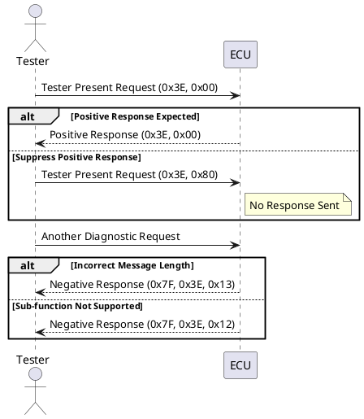

## "Tester Present" (0x3E)

### Introduction

The "Tester Present" service (0x3E) in Unified Diagnostic Services (UDS) is crucial for maintaining the active state of ECUs (Electronic Control Units) during diagnostic sessions. This service prevents the ECU from reverting to the default session when there's no diagnostic communication for an extended period. This is particularly useful in scenarios where the tester requires the ECU to stay in a non-default session without continuous communication from other services.

### Purpose

The primary purpose of the Tester Present service is to inform ECUs that a diagnostic tester is still connected and that the current diagnostic session should remain active. This service can be used in any session other than the default session.

### Sub-functions

The Tester Present service supports two sub-functions:

1. **Zero Sub-function (0x00)**: This indicates a normal Tester Present request, where the ECU is expected to send a positive response.
2. **Suppress Positive Response Sub-function (0x80)**: This request instructs the ECU not to send a positive response, thus reducing network traffic.

### Message Format

#### Request Frame

The Tester Present request message consists of the following:

1. **Service ID (1 byte)**: 0x3E
2. **Sub-function (1 byte)**: 0x00 or 0x80

#### Positive Response Frame

When a positive response is expected, the ECU responds with:

1. **Service ID (1 byte)**: 0x3E
2. **Sub-function (1 byte)**: 0x00 or 0x80

#### Negative Response Frame

If there's an issue with the request, the ECU sends a negative response:

1. **Negative Response Code (1 byte)**: 0x7F
2. **Service ID (1 byte)**: 0x3E
3. **NRC Code (1 byte)**: Specific error code

### Negative Response Codes (NRC)

- **0x12 (Sub-function Not Supported)**: Indicates that the sub-function requested is not supported by the ECU.
- **0x13 (Incorrect Message Length)**: Indicates that the message length is incorrect.

### Usage Scenario

Consider a scenario where a tester needs the ECU to stay in an extended diagnostic session for an extended period, perhaps to perform routine control or security access tasks. During these periods, there might be no continuous communication. The Tester Present service (0x3E) is used to ensure the ECU remains in the non-default session.

### Detailed Sub-function Explanation

- **Zero Sub-function (0x00)**:

  - Sent by the tester to indicate a normal request.
  - The ECU responds positively unless otherwise instructed.
- **Suppress Positive Response (0x80)**:

  - Sent by the tester to suppress the positive response.
  - This helps in reducing network traffic and can be used when the tester does not require an acknowledgment.

### Sequence Diagram

Below is a sequence diagram illustrating the interaction between the tester and the ECU using the Tester Present service:

### Practical Example

#### Scenario: Wiper Motor Timer Adjustment

In a practical example, consider an ECU managing a wiper motor that requires the adjustment of a 555 Timer IC. This adjustment can only be performed in an extended diagnostic session. The Tester Present service is used to ensure that the ECU remains in the extended session while the adjustment routine is carried out, even if there's no continuous communication from other services.

### Conclusion

The Tester Present (0x3E) service is a vital part of UDS, ensuring that ECUs remain in the required diagnostic session. Understanding how to use its sub-functions effectively can help maintain stable communication and diagnostic processes, especially during extended diagnostic operations.

By implementing the Tester Present service correctly, diagnostic tools can keep ECUs in the desired session, avoiding unnecessary resets and ensuring smooth and continuous diagnostic procedures.
