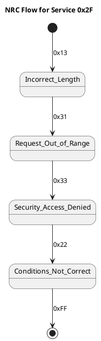
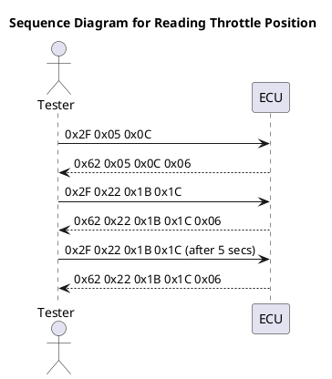

### UDS (Unified Diagnostic Services) Tutorial: Input Output Control by Data Identifier (Service 0x2F)

#### Introduction

Unified Diagnostic Services (UDS) is a protocol used in the automotive industry for diagnostics and communication between a vehicle's electronic control unit (ECU) and a diagnostic tool. This tutorial focuses on the Input Output Control by Data Identifier (DID), specifically the service 0x2F. This service is essential for controlling I/O (sensors/actuators) to achieve desired outcomes through feedback systems.

---

#### Purpose of I/O Control by Data Identifier (0x2F)

The primary purpose of controlling the system/IO is to achieve the desired results with the help of a feedback system. This involves manipulating the inputs and outputs of various sensors and actuators within the vehicle to ensure optimal performance and response.

---

#### Request and Response Formats

**Positive Response Frame Format:**

- **Service ID:** 0x2F
- **Example:** Reading current throttle position data.

    **Request:**
    ```
    0x2F 0x05 0x0C
    ```
    Where:
    - `0x05` represents a short-term adjustment.
    - `0x0C` represents the control state with 12% throttle position.

    **Response:**
    ```
    0x62 0x05 0x0C 0x06
    ```
    Where:
    - `0x62` is the positive response.
    - `0x05 0x0C` is echoed back.
    - `0x06` represents the data (throttle position at 6%).

**Negative Response Frame Format:**

- **Service ID:** 0x7F followed by 0x2F.
- **Example of Negative Responses and their NRCs:**

    - `0x13`: Incorrect Message Length Or Invalid Format in PCI length declaration.
    - `0x22`: Conditions Not Correct (e.g., criteria for security access not met).
    - `0x31`: Request out of range (invalid DID).
    - `0x33`: Security Access Denied (request made without unlocking the ECU).
    - `0x35`: Invalid Key (key value does not match stored value).
    - `0x36`: Exceed number of attempts (maximum invalid attempts exceeded).
    - `0x37`: Required Time Delay not expired (delay timer active and request sent prematurely).

---

#### NRC Flow for Service 0x2F



---

### Practical Example: Reading Throttle Position

**Reading Current Throttle Position Data:**

1. **Initial Request:**
    ```
    0x2F 0x22 0x1B 0x1C
    ```
    - This request asks for the current throttle position.

2. **Immediate Response:**
    ```
    0x62 0x22 0x1B 0x1C 0x06
    ```
    - Positive response indicating the throttle position is at 6%.

3. **Delayed Response (after 5 seconds):**
    ```
    0x2F 0x22 0x1B 0x1C
    ```
    - Request sent again after a delay to ensure consistent data retrieval.

---

### Supported Negative Response Codes (NRCs) for Service 0x2F

1. **Incorrect Message Length or Invalid Format (0x13):**
    - Triggered when the request message has an incorrect length or invalid format.

2. **Conditions Not Correct (0x22):**
    - Occurs if the request does not meet certain criteria, such as unmet security access conditions.

3. **Request Out of Range (0x31):**
    - When the DID requested is not supported or is invalid.

4. **Security Access Denied (0x33):**
    - When a request is made without proper security access.

5. **Invalid Key (0x35):**
    - When the key value in the request does not match the stored value in the server.

6. **Exceed Number of Attempts (0x36):**
    - Triggered when the number of invalid attempts exceeds the allowed maximum.

7. **Required Time Delay Not Expired (0x37):**
    - When a request is made before the required time delay has expired.

---

### Sequence Diagram for Reading Throttle Position



This tutorial provides a detailed understanding of the Input Output Control by Data Identifier (0x2F) service in UDS. It includes the purpose, request and response formats, practical examples, supported NRCs, and sequence diagrams for better comprehension. By following this tutorial, one can effectively implement and troubleshoot this service in automotive diagnostics.